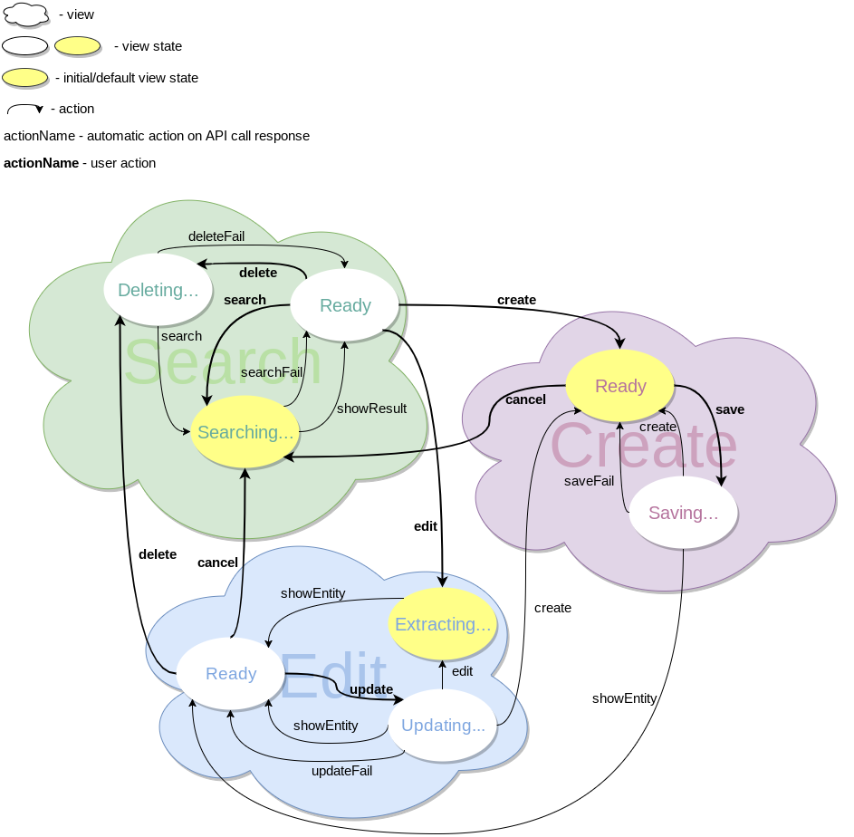

# CRUD Editor

Table of Content

- [Terminology](#terminology)
- [Usage](#usage)
- [*EditorComponent*](#editorcomponent)
    * [props.view](#editorcomponent-propsview)
    * [props.state](#editorcomponent-propsstate)
    * [props.onTransition](#editorcomponent-propsontransition)
    * [props.onExternalOperation](#editorcomponent-propsonexternaloperation)
- [Entity Configuration](#entity-configuration)
    * [Configuration Object Structure](#configuration-object-structure)
    * [FieldInputComponent](#fieldinputcomponent)
    * [FieldRenderComponent](#fieldrendercomponent)
    * [TabFormComponent](#tabformcomponent)
    * [ViewComponent](#viewcomponent)
    * [doTransition](#dotransition)
- [Store](#store)
    * [State Structure](#state-structure)
    * [Validation Error](#validation-error)
    * [Internal Error](#internal-error)
- [Transitions of views and their states](#transitions-of-views-and-their-states)
- [TODO](#todo)

## Terminology

<dl>
  <dt>Logical ID</dt>
  <dd>Entity instance's visible string ID, which may or may not be DB <i>Primary ID</i>.</dd>

  <dt>Operation</dt>
  <dd>Optional actions to be perfomed with an entity instance. There are three kinds of operations:
    <ul>
      <li id="internal-operation"><i>Internal</i> - predefined operation. Its handler is defined inside CRUD Editor,</li>
      <br />
      <li id="custom-operation"><i>Custom</i> - custom operation which handler is defined in <a href="#entity-configuration">Entity Configuration</a>'s <b>ui.operations</b> property.<br /><br /><i>Custom operation</i> has higher priority over internal operation, i.e. may overwrite it.</li>
      <br />
      <li id="external-operation"><i>External</i> - operation which handler is defined by an application as a callback function passed to <a href="#editorcomponent-propsonexternaloperation"><i>EditorComponent</i> props.onExternalOperation</a>.<br /><br /><i>External Operation</i> has higher priority over <a href="#custom-operation">Custom</a>/<a href="#internal-operation">Internal</a> Operation, i.e. may overwrite it.</li>
    </ul>
  </dd>
  <dt id="persistent-field">Persistent field</dt>
  <dd>Entity attribute stored on server and returned as instance property by api.get() and api.search() calls. CRUD Editor does not necessarily knows about and works with <i>all</i> persistent fields, but only those listed in <a href="#entity-configuration">Entity Configuration</a>'s <b>model.fields</b>.</dd>
  <dt>Auditable field</dt>
  <dd>One of the following <a href="#persistent-field">Persistent fields</a>:<ul><li>createdBy</li><li>changedBy</li><li>createdOn</li><li>changedOn</li></ul></dd>
  <dt id="store-state">Store State</dt>
  <dd>Redux <a href="#store">store</a> <a href="#state-structure">state</a> of CRUD Editor. It must be serializable.</dd>
  <dt id="editor-state">Editor State</dt>
  <dd>CRUD Editor state which may be saved and later restored by e.g. an application. It is a subset of <a href="#store-state">Store State</a> and contains information about active View <a href="#editorcomponent-propsview">ID</a>/<a href="#editorcomponent-propsstate">State</a>. See <a href="#editorcomponent-propsontransition"><i>EditorComponent</i> props.onTransition</a> for <i>Editor State</i> structure.</dd>
</dl>

## Usage

```javascript
// 'contract-crudeditor' package.
import React from 'react';
import crudEditor from 'react-crudeditor';

const ContractEditor = crudEditor(<Entity Configuration>);
export default ContractEditor;
```

```javascript
// application.
import React from 'react';
import ContractEditor from 'contract-crudeditor';

export default class extends React.Component {
  render() {
    return (
      ...
      <ContractEditor
        ?view={<string>}
        ?state={<object>}
        ?onTransition={<function>}
        ?onExternalOperation={<object>}
      />;
      ...
    )
```

`crudEditor` is a function which the only argument is [Entity Configuration](#entity-configuration) object. It returns [*EditorComponent*](#editorcomponent).

## *EditorComponent*

React component with the following props:

Name | Default | Description
---|---|---
[view](#editorcomponent-propsview) | "search" | View ID
[state](#editorcomponent-propsstate) | `{}` | Full/sliced View State
[onTransition](#editorcomponent-propsontransition) | - | [Editor State](#editor-state) transition handler
[onExternalOperation](#editorcomponent-propsonexternaloperation) | - | Set of [External Operations](#external-operation) handlers

### *EditorComponent* props.view

ID of a custom/standard View. *Custom Views* are defined in [Entity Configuration](#entity-configuration)'s **ui.customViews**. *Standard View* is one of:

View ID | Description
---|---
search | Search criteria and result
create | New entity instance creation
edit | Existing entity instance editing
show | The same as *edit* but in read-only mode
error | Error page

### *EditorComponent* props.state

Full/sliced State describing [props.view](#editorcomponent-propsview).  Its structure is determined by View it describes.

If View State is sliced, not given or `{}`, all not-mentioned properties retain their current values (or default values in case of initial [*EditorComponent*](#editorcomponent) rendering).

View State *must* be serializable.

#### *EditorComponent* props.state for *"search"* View:

```javascript
{
  ?filter: {
    <field name>: <serializable, filter value for the field>,
    ...
  },
  ?sort: <string, sort field name>,
  ?order: <"asc"|"desc", sort order>,
  ?max: <natural number, search result limit>,
  ?offset: <whole number, search result offset>
}
```

Name | Default
---|---
filter | <ul><li>`{}` - for initial View rendering,</li><li>CRUD Editor current value - otherwise.</li></ul>
sort | <ul><li>Result field marked with `sortByDefault` (first result field if no `sortByDefault` marker is set) - for initial View rendering</li><li>CRUD Editor current value - otherwise.</li></ul>
order | <ul><li>`"asc"` - for initial View rendering,</li><li>CRUD Editor current value - otherwise</li></ul>
max | <ul><li>`30` - for initial View rendering,</li><li>CRUD Editor current value - otherwise.</li></ul>
offset | `0`

#### *EditorComponent* props.state for *"create"* View:

```javascript
{}
```

#### *EditorComponent* props.state for *"edit"* and *"show"* Views:

```javascript
{
  id: <string, entity instance Ligical ID>,
  ?tab: <string, active tab name>
}
```

Name | Default
---|---
id | -
tab | First tab name

#### *EditorComponent* props.state for *"error"* View:

```javascript
{
  code: <natural number, error code>,
  ?payload: <any, structure is defined by error code>
}
```

Name | Default
---|---
code | -
payload | -

### *EditorComponent* props.onTransition

A transition handler to be called after [Editor State](#editor-state) changes. Its only argument is [Editor State](#editor-state) object. Usually the function reflects [Editor State](#editor-state) to URL.  It may also change [Editor State](#editor-state) by rendering [*EditorComponent*](#editorcomponent) with new *props*.

```javascript
function ({
  view: <string, View ID>,  // See EditorComponent props.view
  state: <object, Full View State>  // See EditorComponent props.state
}) {
  ...
  return;  // Return value is ignored.
}
```

### *EditorComponent* props.onExternalOperation

An object with [External Operations](#external-operation) handlers.  A handler is called when a corresponding [External Operation](#external-operation) is triggered by CRUD Editor.

```javascript
{
  <external operation name>: function({ instance, view, state }) {
    ...
    return;  // Return value is ignored.
  },
  ...
}
```

Every handler has the same set of arguments:

Argument | Type | Description
---|---|---
instance | object | An entity instance which [External Operation](#external-operation) was called upon.
view | string | [View ID](#editorcomponent-propsview) at the time when [External Operation](#external-operation) was called
state | object | Full [View State](#editorcomponent-propsstate) at the time when [External Operation](#external-operation) was called

## Entity Configuration

### Configuration Object Structure

Entity Configuration is an object describing an entity. It has the following structure:

```javascript
{
  model: {
    name: <string, usually singular entity name>,
    idField: <string, Logical ID field name>,

    /*
     * Persistent fields CRUD Editor is interested in.
     */
    fields: {
      <field name>: {

        /*
         * Standard field type, "string" by default.
         * It defines a React Component for displaying a field value.
         * Types other than listed are ignored.
         * If a field does not hava a standard type and wants to be displayed, custom React
         * Component(s) must be provided in corresponding sections of the configuration.
         */
        ?type: <"string"|"number"|"date"|"boolean">,

        /*
         * Constraints for field validation.
         * They are usually applied during entity instance creation/modification.
         */
        ?constraints: {
          ?max: <number|date, max length for strings or max value for dates/numbers>,
          ?min: <number|date, min length for strings or min value for dates/numbers>,
          ?required: <boolean, whether the field value can be empty>,
          ?email: <boolean>,
          ?matches: <regexp>,
          ?url: <boolean>,

          /*
           * Custom validator returning a promise of boolean
           * - true for pass,
           * - false for fail.
           */
          ?async validate: function(<serializable, field value>, <object, entity instance>) {...}
        }
      },
      ...
    }
  },

  /*
   * Methods for async operations.
   * Each method returns a promise.  In case of failure it rejects to
   * {
   *   code: <whole number, error code>,
   *   ?payload: <any, structure is defined by error code>
   * }
   */
  api: {
    /*
     * get single entity instance by its Logical ID.
     */
    async get: function(<string, Logical IDs>) {
      ...
      return {
        <field name>: <serializable, field value>,
        ...
      };
    },

    /*
     * search for entity instances by a criteria.
     */
    async search: function({
      ?filter: {
        <field name>: <serializable, filter value for the field>,
        ...
      },
      ?sort: <string, sort field name>,
      ?order: <"asc"|"desc", sort order>,
      ?max: <natural number, search result limit>,
      ?offset: <whole number, search result offset>
    }) {
      ...
      return {
        instances: [{
          <field name>: <serializable, field value>,
          ...
        }, ...],
        totalCount: <whole number, total number of filtered entity instances>
      };
    },

    /*
     * delete entity instances transactionally by their Logical IDs.
     */
    async delete: function(<array[string], Logical IDs>) {
      return {
        count: <whole number, how many entity instances where actually deleted>
      };
    },

    /*
     * create new entity instance and return its actial server copy.
     */
    async create: function({
      <field name>: <serializable, field value>,
      ...
    }) {
      ...
      return {
        <field name>: <serializable, field value>,
        ...
      };
    },

    /*
     * update existing entity instance and return its actial server copy.
     */
    async update: function({
      <field name>: <serializable, field value>,
      ...
    }) {
      ...
      return {
        <field name>: <serializable, field value>,
        ...
      };
    }
  },

  ?ui: {
    ?search: function() {
      ...
      return {
        /*
         * Only Persistent fields from model.fields are allowed.
         * By default, all Persistent (but not Auditable) fields from model.fields
         * are used for building search criteria.
         */
        ?searchableFields: [{
          name: <string, persistent field name>,
          ?Component: <FieldInputComponent>  // see "FieldInputComponent" subheading.
        }, ...],

        /*
         * Both persistent and composite fields are allowed.
         * By default, all Persistent fields from model.fields are used in result listing.
         * Only one field may have "sortByDefault" set to true.
         */
        ?resultFields: [{
          name: <string, persistent or composite field name>,
          ?sortable: <boolean, false by default>,
          ?sortByDefault: <boolean, false by default>,
          ?textAlignment: <"left"|"center"|"right">,
          ?Component: <FieldRenderComponent>  // see "FieldRenderComponent" subheading.
        }, ...]
      };
    },

    ?createEditShow: function(<"create"|"edit"|"show">) {
      ...
      return {

        /*
         * Generate label for entity instance description.
         * Default is instance._objectLabel
         */
        ?instanceDescription(<object, entity instance>) {
          ...
          return <string, entity instance description>;
        },

        /*
         * layout(), tab() and section() may accept false/undefined/null arguments which a ignored.
         * See "TabFormComponent" and "FieldInputComponent" subheading for React components props.
         *
        ?formLayout({
          layout: <function>,
          tab: <function>,
          section: <function>,
          field: <function>,
          instance: <object, entity instance>
        }) {
          return layout(
            ?tab({name: <string>, ?disabled: <boolean>, ?Component: <TabFormComponent>},
              ?section({name: <string>},
                ?field({name: <string>, ?hidden: <boolean>, ?readOnly: <boolean>, ?Component: <FieldInputComponent>}),
                ...
              ),
              ?field({name: <string>, ?hidden: <boolean>, ?readOnly: <boolean>, ?Component: <FieldInputComponent>}),
              ...
            ),
            ?section({name: <string>, ?hidden: <boolean>},
              ?field({name: <string>, ?hidden: <boolean>, ?readOnly: <boolean>, ?Component: <FieldInputComponent>}),
              ...
            ),
            ?field({name: <string>, ?hidden: <boolean>, ?readOnly: <boolean>, ?Component: <FieldInputComponent>}),
            ...
          );
        }
      }
    },

    /*
     * Views in addition to standard ones.
     */
    ?customViews: {
      <view name>: <ViewComponent>,  // see "ViewComponent" subheading.
      ...
    },

    /*
     * Generate and return an entity instance with predefined field values.
     * The instance is not persistent.
     */
    ?defaultNewInstance: function(<object, "search" View State>) {
      ...
      return <object, entity instance>;
    },

    /*
     * Internal, Custom and External operations available in CRUD Editor.
     * An operation handler is called by pressing a dedicated button.
     * Handlers are provided for Custom Operations.
     */
    ?operations: function(<object, entity instance>, <string, View ID>) {
      ...
      return [{
        name: <string, operation ID>,
        ?icon: <string, name of an icon to be displayed inside a button>,

        // handler for a Custom Operation.
        ?handler: function() {
          ...
          return {
            ?view: <string, View ID, active View by default>,
            ?state: <object, View State, empty object by default>
          };
        }
      }, ...]
    }
  }
}
```

### FieldInputComponent

React component for a custom rendering of entity instance field in Search Form or Create/Edit Form.

Props:

Name | Type | Necessity | Default | Description
---|---|---|---|---
id | string | optional | - | ID of DOM element which must be focused on label click
readOnly | boolean | optional | false | Wheter field value can be changed
value | serializable | mandatory | - | [Persistent field](#persistent-field) value
onChange | function | mandatory | - | Handler called when Component's value changes.<pre><code class="javascript">function(&lt;serializable, new field value&gt;) &#123;<br />&nbsp;&nbsp;...<br />&nbsp;&nbsp;return;  // return value is ignored<br />&#125;</code></pre>
onBlur | function | optional | - | Handler called when Component loses focus.<pre><code class="javascript">function() &#123;<br />&nbsp;&nbsp;...<br />&nbsp;&nbsp;return;  // return value is ignored<br />&#125;</code></pre>

### FieldRenderComponent

React component for a custom rendering of instance [persistent](#persistent-field)/composite field value in Search Result listing.

Props:

Name | Type | Necessity | Default | Description
---|---|---|---|---
name | string | mandatory | - | Field name from [Entity Configuration](#entity-configuration)'s **ui.search().resultFields**
instance | object | mandatory | - | Entity instance

### TabFormComponent

React component for a custom rendering of Tab form in create/edit/show Views.

Props:

Name | Type | Necessity | Default | Description
---|---|---|---|---
view | string | mandatory | - | [View ID](#editorcomponent-propsview)
state | object | mandatory | - | [View State](#editorcomponent-propsstate)
[doTransition](#dotransition) | function | optional | - | [Editor State](#editor-state) change handler

### ViewComponent

React component for a custom View.

Props:

Name | Type | Necessity | Default | Description
---|---|---|---|---
state | object | mandatory | - | Custom [View State](#editorcomponent-propsstate)
[doTransition](#dotransition) | function | optional | - | [Editor State](#editor-state) change handler

### doTransition

This handler is called when

 - active View changes its [State](#editorcomponent-propsstate), *view* argument is optional in such case;
 - another [View](#editorcomponent-propsview) must be displayed, *state* argument is optional in such case.

```javascript
function ({
  ?view: <string, View ID>,
  ?state: <object, View State>
}) {
  ...
  return;  // return value is ignored.
}
```

Arguments:

Name | Default | Description
---|---|---
view | active View | To-be-displayed [View ID](#editorcomponent-propsview)
state | `{}` | Full/sliced to-be-displayed [View State](#editorcomponent-propsstate).

## Store

### State Structure

```javascript
{
  general: {
    activeView: <"search"|"create"|"edit"|"show"|"error">
  },
  views: {
    search: {

      /*
       * filter used in Search Result
       */
      resultFilter: {
        <field name>: <serializable, filter value for the field>,
        ...
      },

      /*
       * raw filter as displayed in Search Form
       * (may be equal to or different from "resultFilter")
       */
      formFilter: {
        <field name>: <serializable, filter value for the field>,
        ...
      }

      sortParams: {
        sort: <string, sort field name>,
        order: <"asc"|"desc", sort order>,
      },
      pageParams: {
        max: <natural number, search result limit>,
        offset: <whole number, search result offset>,
      }
      resultInstances: [{
        <field name>: <serializable, field value>,
        ...
      }, ...],
      selectedInstances: [
        <ref, reference to an object from "instances" array>,
        ...
      ],
      totalCount: <whole number, total number of filtered entity instances>,
      status: <"ready"|"searching"|"deleting", search view status>
    },
    create: {
      instance: {
        <field name>: <serializable, field value>,
        ...
      },
      status: <"ready"|"saving">

      /*
       * validation or internal error
       * (all other errors are displayed on "error" view)
       */
      error: <Validation Error|Internal Error>,  // See relevant subheadings.
    },
    edit: {

      /*
       * instance in its "canonical state", i.e. as present on the server
       */
      persistentInstance: {
        <field name>: <serializable, field value>,
        ...
      },

      /*
       * row instance as displayed in Edit Form
       */
      formInstance: {
        <field name>: <serializable, field value>,
        ...
      },

      tab: <string, active tab name>,
      status: <"ready"|"extracting", edit view status>

      /*
       * validation or internal error
       * (all other errors are displayed on "error" view)
       */
      error: <Validation Error|Internal Error>  // See relevant subheadings.
    },
    show: {
      instance: {
        <field name>: <serializable, field value>,
        ...
      },
      tab: <string, active tab name>,
      status: <"ready"|"extracting", show view status>
    },
    error: {
      code: <natural number, error code>,
      ?payload: <any, structure is defined by error code>
    }
  }
}
```

### Validation Error

```javascript
{
  code: 400,
  payload: {
    <field name>: [{
      code: <natural number, error code>,
      ?message: <string, error message>
    }, ...]
  }
}
```

### Internal Error

```javascript
{
  code: 500,
  ?payload: <string, error message>
}
```

## Transitions of views and their states



## Code structure

**NOTE**: It's entirely possible for a reducer defined in one folder to respond to an action defined in another folder.

    project-root/
    └── client/
        ├── rootReducer.js
        ├── globalSelectors.js
        ├── common/
        ├── views/
        │   └── search/
        │       ├── constants.js
        │       ├── actions/
        │       │   └── ....
        │       ├── components/
        │       │   └── ....
        │       ├── containers/
        │       │   └── ....
        │       ├── reducers/
        │       │   └── ...
        │       ├── sagas/
        │       │   └── ...
        │       └── selectors/
        │           └── ...
        └── services/
            └── ...

## TODO

Not implemented:

- isCreateSupported,
- duplicationConfiguration,
- cmlExportConfiguration
