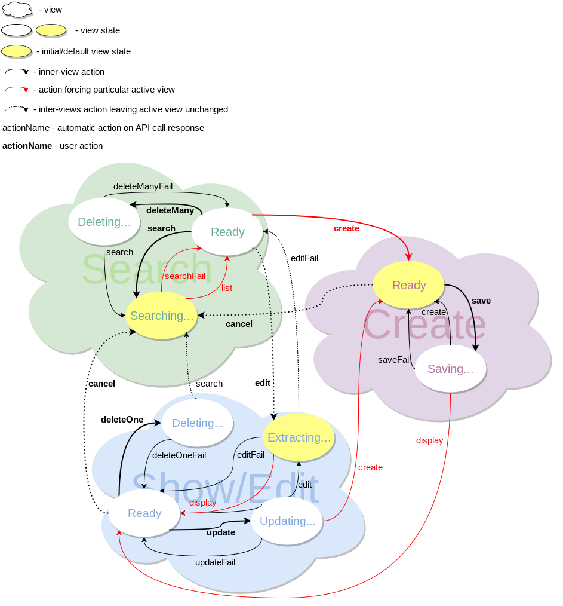
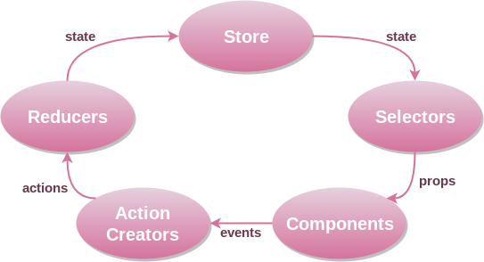

[](https://circleci.com/gh/OpusCapita/react-crudeditor)

### Demo: [contracts editor](https://opuscapita.github.io/react-crudeditor/branches/master/).

# CRUD Editor

Table of Content

- [Terminology](#terminology)
- [Usage](#usage)
- [*EditorComponent*](#editorcomponent)
    * [props.view.name](#editorcomponent-propsviewname)
    * [props.view.state](#editorcomponent-propsviewstate)
    * [props.onTransition](#editorcomponent-propsontransition)
    * [props.onExternalOperation](#editorcomponent-propsonexternaloperation)
- [Model Definition](#model-definition)
    * [Definition Object Structure](#definition-object-structure)
    * [FieldInputComponent](#fieldinputcomponent)
    * [FieldRenderComponent](#fieldrendercomponent)
    * [TabFormComponent](#tabformcomponent)
    * [ViewComponent](#viewcomponent)
    * [doTransition](#dotransition)
- [Redux Store](#redux-store)
    * [State Structure](#state-structure)
    * [Parsing Error and Field/Instance Validation Error](#parsing-error-and-fieldinstance-validaton-error)
    * [Internal Error](#internal-error)
- [*model* Property](#model-property)
    * [Search View *model* Property](#search-view-model-property)
    * [Create View *model* Property](#create-view-model-property)
    * [Edit View *model* Property](#edit-view-model-property)
    * [Show View *model* Property](#show-view-model-property)
    * [Error View *model* Property](#error-view-model-property)
- [Diagrams](#diagrams)
    * [Transitions of views and their states](#transitions-of-views-and-their-states)
    * [Data Flow](#data-flow)
- [Code Conventions](#code-conventions)
    * [Redux Actions](#redux-actions)
    * [Code Structure](#code-structure)
- [TODO](#todo)

## Terminology

<dl>
  <dt>Logical Key</dt>
  <dd>Field(s) and their value(s) constituting visible unique identifier of an entity instance. It may or may not be DB <i>Primary ID</i>.</dd>

  <dt>Operation</dt>
  <dd>Optional actions to be perfomed with an entity instance. There are three kinds of operations:
    <ul>
      <li id="internal-operation"><i>Internal</i> - predefined operation. Its handler is defined inside CRUD Editor,</li>
      <br />
      <li id="custom-operation"><i>Custom</i> - custom operation which handler is defined in <a href="#model-definition">Model Definition</a>'s <b>ui.operations</b> property.<br /><br /><i>Custom operation</i> has higher priority over internal operation, i.e. may overwrite it.</li>
      <br />
      <li id="external-operation"><i>External</i> - operation which handler is defined by an application as a callback function passed to <a href="#editorcomponent-propsonexternaloperation"><i>EditorComponent</i> props.onExternalOperation</a>.<br /><br /><i>External Operation</i> has higher priority over <a href="#custom-operation">Custom</a>/<a href="#internal-operation">Internal</a> Operation, i.e. may overwrite it.</li>
    </ul>
  </dd>
  <dt id="persistent-field">Persistent Field</dt>
  <dd>Entity attribute stored on server and returned as instance property by api.get() and api.search() calls. CRUD Editor does not necessarily knows about and works with <i>all</i> persistent fields, but only those listed in <a href="#model-definition">Model Definition</a>'s <b>model.fields</b>.</dd>
  <dt id="composite-field">Composite Field</dt>
  <dd>In contrast to a <a href="#persistent-field">Persistent field</a>, <i>composite field</i> is not stored on server and represents some combination of <a href="#persistent-field">Persistent fields</a>.  It is only used for displaying an entity instance in Search Result listing.</dd>
  <dt>Auditable field</dt>
  <dd>One of the following <a href="#persistent-field">Persistent fields</a>:
    <ul>
      <li>createdBy</li>
      <li>changedBy</li>
      <li>createdOn</li>
      <li>changedOn</li>
    </ul>
  </dd>
  <dt id="store-state">Store State</dt>
  <dd><a href="#redux-store">Redux store</a> <a href="#state-structure">state</a> of CRUD Editor. It must be serializable.</dd>
  <dt id="editor-state">Editor State</dt>
  <dd>CRUD Editor state which may be saved and later restored by e.g. an application. It is a subset of <a href="#store-state">Store State</a> and contains information about active View <a href="#editorcomponent-propsviewname">Name</a>/<a href="#editorcomponent-propsviewstate">State</a>. See <a href="#editorcomponent-propsontransition"><i>EditorComponent</i> props.onTransition</a> for <i>Editor State</i> structure.</dd>
  <dt id="field-type">Field Type</dt>
  <dd>
    Field classification, "string" by default. Standard types are
    <ul>
      <li>boolean,</li>
      <li>date,</li>
      <li>number,</li>
      <li>string.</li>
    </ul>
    Other types are allowed as well, ex. "collection", "com.jcatalog.core.DateRange", etc.
    <br /><br />
    React Components for displaying fields of standard types are predefined.  Rendering of non-standard types fields requires specifying custom React Components (see <a href="#fieldinputcomponent">FieldInputComponent</a> and <a href="#fieldrendercomponent">FieldRenderComponent</a>) in <a href="#model-definition">Model Definition</a>'s <b>ui.search</b>, <b>ui.create</b>, <b>ui.edit</b> and <b>ui.show</b>.
    <br /><br />
    <i>Field Type</i> has nothing to do with JavaScript types since field value is always a string; it is to allow correct interpretation of the string.
    <br />
    <br />
    <i>Field Types</i> are defined in <a href="#model-definition">Model Definition</a>'s <b>model.fields</b>.
  </dd>
  <dt id="ui-type">UI Type</dt>
  <dd>
    Type a field value must be converted to/from for communication with React Component rendering the field.  Every field value is formated from its <a href="#field-type">Field Type</a> to appropriate <i>UI Type</i> before sending to a React Component, and parsed from the <i>UI Type</i> back to its <a href="#field-type">Field Type</a> after the React Component modifies the value and returns it in onChange event handler.
    <br/>
    <br/>
    <i>UI Type</i> has nothing to do with JavaScript types and defines a structure of any serializable data.
    <br/>
    <br/>
    <i>UI Types</i> are defined in <b>render.valueProp.type</b> of <b>searchableFields</b> and <b>formLayout</b> (see <a href="#model-definition">Model Definition</a>'s <b>ui.search</b>, <b>ui.create</b>, <b>ui.edit</b> and <b>ui.show</b>)
  </dd>
  <dt>Instance</dt>
  <dd>An object CRUD operations are performed upon.  Each instance has three different representations in CRUD Editor:
    <ul>
      <li id="persistent-instance"><i>Persistent Instance</i> - an instance as stored on server.</li>
      <li id="form-instance"><i>Form Instance</i> - an instance as displayed in Search/Create/Show/Edit Form.  It is distint from <a href="#persistent-instance">Persistent Instance</a> when a user modified the instance but has not saved changes yet.</li>
      <li id="formated-instance"><i>Formated Instance</i> - <a href="#form-instance">Form Instance</a> with field values formated to <a href="#ui-type">UI Type</a>.</li>
    </ul>
    </dd>
</dl>

## Usage

```javascript
// 'contract-crudeditor' package.
import React from 'react';
import crudEditor from '@opuscapita/react-crudeditor';

const ContractEditor = crudEditor(<Model Definition>);
export default ContractEditor;
```

```javascript
// application.
import React from 'react';
import ContractEditor from 'contract-crudeditor';

export default class extends React.Component {
  render() {
    return (
      ...
      <ContractEditor
        ?view={?name: <string>, ?state: <object>}
        ?onTransition={<function>}
        ?onExternalOperation={<object>}  // TODO
      />;
      ...
    )
```

`crudEditor` is a function which the only argument is [Model Definition](#model-definition) object. It returns [*EditorComponent*](#editorcomponent).

## *EditorComponent*

React component with the following props:

Name | Default | Description
---|---|---
view | {<br />&nbsp;&nbsp;name: "search",<br />&nbsp;&nbsp;state: {}<br />}| [View Name](#editorcomponent-propsviewname) and full/sliced [View State](#editorcomponent-propsviewstate)
[onTransition](#editorcomponent-propsontransition) | - | [Editor State](#editor-state) transition handler
[onExternalOperation](#editorcomponent-propsonexternaloperation) | - | Set of [External Operations](#external-operation) handlers

### *EditorComponent* props.view.name

Name of a custom/standard View. *Custom Views* are defined in [Model Definition](#model-definition)'s **ui.customViews**. *Standard View* is one of:

View Name | Description
---|---
search | Search criteria and result
create | New entity instance creation
edit | Existing entity instance editing
show | The same as *edit* but read-only
error | Error page

### *EditorComponent* props.view.state

Full/sliced State describing [props.view.name](#editorcomponent-propsviewname).  Its structure is determined by View it describes.

If View State is sliced, not given or `{}`, all not-mentioned properties have their default values.

View State *must* be serializable.

#### *EditorComponent* props.state for *"search"* View:

```javascript
{
  ?filter: {
    <field name>: <serializable, filter value for the field>,
    ...
  },
  ?sort: <string, sort field name>,
  ?order: <"asc"|"desc", sort order>,
  ?max: <natural number, search result limit>,
  ?offset: <whole number, search result offset>
}
```

Name | Default
---|---
filter | `{}`
sort | Result field marked with `sortByDefault` (first result field if no `sortByDefault` marker is set)
order | `"asc"`
max | `30`
offset | `0`

#### *EditorComponent* props.state for *"create"* View:

```javascript
{
  ?instance: <object, an entity instance with predefined field values>
}
```

Name | Default
---|---
instance | {}

#### *EditorComponent* props.state for *"edit"* and *"show"* Views:

```javascript
{
  instance: <object, an entity instance with Logical Key fields only>,
  ?tab: <string, active tab name>
}
```

Name | Default
---|---
instance | -
tab | First tab name

#### *EditorComponent* props.state for *"error"* View:

```javascript
{
  code: <natural number, error code>,
  ?payload: <any, structure is defined by error code>
}
```

or

```javascript
[{
  code: <natural number, error code>,
  ?payload: <any, structure is defined by error code>
}, ...]
```

Name | Default
---|---
code | -
payload | -

### *EditorComponent* props.onTransition

A transition handler to be called after [Editor State](#editor-state) changes to the one with "ready" status. Its only argument is [Editor State](#editor-state) object. Usually the function reflects [Editor State](#editor-state) to URL.  It may also change [Editor State](#editor-state) by rendering [*EditorComponent*](#editorcomponent) with new *props*.

```javascript
function ({
  name: <string, View name>,  // See EditorComponent props.view.name
  state: <object, Full View State>  // See EditorComponent props.view.state
}) {
  ...
  return;  // Return value is ignored.
}
```

### *EditorComponent* props.onExternalOperation

An object with [External Operations](#external-operation) handlers.  A handler is called when a corresponding [External Operation](#external-operation) is triggered by CRUD Editor.

```javascript
{
  <external operation name>: function({ instance, view, state }) {
    ...
    return;  // Return value is ignored.
  },
  ...
}
```

Every handler has the same set of arguments:

Argument | Type | Description
---|---|---
instance | object | An entity instance which [External Operation](#external-operation) was called upon
view | {<br />&nbsp;&nbsp;name: &lt;string&gt;,<br />&nbsp;&nbsp;state: &lt;object&gt;<br />} | View [Name](#editorcomponent-propsviewname)/Full [State](#editorcomponent-propsviewstate) at the time when [External Operation](#external-operation) was called

## Model Definition

### Definition Object Structure

Complete example of the model configuration file: [contracts model](https://github.com/OpusCapita/react-crudeditor/blob/master/src/demo/models/contracts/index.js).

Model Definition is an object describing an entity. It has the following structure:

```javascript
{
  model: {
    name: <string, usually singular entity name>,

    /*
     * Persistent fields CRUD Editor is interested in.
     */
    fields: {
      <field name>: {
        ?unique: <boolean, whether the field is a part of Logical Key, false by default>,
        ?type: <string, field type (see corresponding "Terminology" section)>,  // TODO more types and their constraints.

        /*
         * Constraints for field validation.
         * Their allowed set and tuning parameters of each constraint depend on field type.
         * Constraints are usually called after field input's "onBlur" event
         * and before saving instance modifications.
         */
        ?constraints: {
          ?max: <number|date, max length for strings or max value for dates/numbers>,
          ?min: <number|date, min length for strings or min value for dates/numbers>,
          ?required: <boolean, whether the field value can be empty>,
          ?email: <boolean>,
          ?matches: <regexp>,
          ?url: <boolean>,

          /*
           * Custom field-validator returning boolean true in case of successful validation,
           * or throwing an array of errors if validation failed.
           */
          validate(<serializable, field value>, <object, entity instance>) {
            ...
            throw [<Field Validation Error>, ...];
            ...
            return true;
          }
        }
      },
      ...
    },

    /*
     * Custom instance-validator, usually called after "Submit" button press
     * but before sending the instance to the server for save/modify.
     * Field-validation is done upon all fields just before calling the instance-validator.
     * The function returns boolean true in case of successful validation,
     * or throws an object with errors if validation failed.
     * The function may also be asyncronous and return a resolved/rejected promise.
     */
    validate(<object, entity instance>) {
      ...
      throw [<Instance Validation Error>, ...];
      ...
      return true;
    }
  },

  /*
   * Methods for async operations.
   * Each method returns a promise.  In case of failure it rejects to
   * {
   *   code: <whole number, error code>,
   *   ?payload: <any, structure is defined by error code>
   * }
   */
  api: {
    /*
     * get single entity instance by its Logical Key.
     */
    async get: function({
      instance: <object, an entity instance with at least Logical Key fields>
    }) {
      ...
      return {
        <field name>: <serializable, field value>,
        ...
      };
    },

    /*
     * search for entity instances by a criteria.
     */
    async search: function({
      ?filter: {
        <field name>: <serializable, filter value for the field>,
        ...
      },
      ?sort: <string, sort field name>,
      ?order: <"asc"|"desc", sort order>,
      ?max: <natural number, search result limit>,
      ?offset: <whole number, search result offset>
    }) {
      ...
      return {
        instances: [{
          <field name>: <serializable, field value>,
          ...
        }, ...],
        totalCount: <whole number, total number of filtered entity instances>
      };
    },

    /*
     * delete entity instances transactionally by their Logical Keys.
     */
    async delete: function({
      instances: <array[object], entity instances with at least Logical Key fields>
    }) {
      return {
        count: <whole number, how many entity instances where actually deleted>
      };
    },

    /*
     * create new entity instance and return its actial server copy.
     */
    async create: function({
      instance: {
        <field name>: <serializable, field value>,
        ...
      }
    }) {
      ...
      return {
        <field name>: <serializable, field value>,
        ...
      };
    },

    /*
     * update existing entity instance and return its actial server copy.
     */
    async update: function({
      instance: {
        <field name>: <serializable, field value>,
        ...
      }
    }) {
      ...
      return {
        <field name>: <serializable, field value>,
        ...
      };
    }
  },

  ?ui: {
    ?Spinner: <React component> to be displayed instead of built-in spinner,

    ?search: function() {
      ...
      return {
        /*
         * Only Persistent fields from model.fields are allowed.
         * By default, all Persistent (excluding Auditable) fields from model.fields
         * are used for building search criteria.
         */
        ?searchableFields: [{
          name: <string, persistent field name>,

          /*
           * Default render:
           * {
           *   // Default React Component for displaying particular field type.
           *   // The following field types have default React Components:
           *   // -- dateString,
           *   // -- numberString,
           *   // -- string,
           *   // -- boolean.
           *   // Custom render must be supplied for all other types.
           *   Component: <function>,
           *
           *   valueProp: {
           *     name: "value",
           *     type: "string"
           *   },
           *
           *   // Boolean, whether the field search is range search.
           *   // It is true for numbers/dates and false for all other values.
           *   // NOTE: it is inappropriate for custom render because custom Component is
           *   //       fully responsible for composing searchable field filter value
           *   //       => isRange is presupposed to be false in such case.
           *   isRange: <boolean>
           * }
           */
          ?render: {
            Component: <FieldInputComponent>,  // see "FieldInputComponent" subheading.
            ?valueProp: {
              ?name: <string, a name of Component prop with field value>,
              ?type: <string, UI Type (see corresponding "Terminology" section)>
            }
          }
        }, ...],

        /*
         * Both persistent and composite fields are allowed.
         * By default, all Persistent (incl. Auditable) fields from model.fields are used in result listing.
         * Only one field may have "sortByDefault" set to true.
         */
        ?resultFields: [{
          name: <string, persistent or composite field name>,
          ?sortable: <boolean, false by default>,
          ?sortByDefault: <boolean, false by default>,
          ?textAlignment: <"left"|"center"|"right">,
          ?Component: <FieldRenderComponent>  // see "FieldRenderComponent" subheading.
        }, ...]
      };
    },

    /*
     * Generate label for entity instance description.
     * Default is instance._objectLabel
     */
    ?instanceLabel(<object, entity instance>) {
      ...
      return <string, entity instance description>;
    },

    ?create: {

      /*
       * Generate and return an entity instance with predefined field values.
       * The instance is not persistent.
       */
      ?defaultNewInstance: function(<object, "search" View State>) {
        ...
        return <object, entity instance>;
      },

      /*
       * tab(), section() and field() may be replaced with false/undefined/null which are ignored.
       *
       * See "TabFormComponent" and "FieldInputComponent" subheading for React components props.
       *
       * If formLayout is not specified, create/edit/show View does not have any tabs/sections
       * and displays all fields from the model. The following fields are read-only in such case:
       * -- all fields in show View,
       * -- Auditable fields in edit View,
       * -- Logical Key fields in edit View.
       */
      ?formLayout: ({ tab, section, field }) => instance => {
        ...
        return [
          ?tab(
            {
              name: <string, tab name>,
              ?disabled: <boolean, false by default>,
              ?Component: <function, TabFormComponent>,
              ?columns: <number>
            },
            ?section(
              { name: <string, section name>, ?columns: <number> },
              ?field({
                name: <string, field name>,
                ?readOnly: <boolean, false by default>,
                ?render: {
                  Component: <function, FieldInputComponent>,
                  ?valueProp: {
                    ?name: <string, a name of Component's prop with field value, "value" by default>,
                    ?type: <string, UI Type (see corresponding "Terminology" section)>
                  }
                }
              }),
              // Passing additional propName property to FieldInputComponent:
              ?field({
                name: <string, field name>,
                ?readOnly: <boolean, false by default>,
                render: {
                  Component: props => <FieldInputComponent propName={propValue} {...props}>,
                  ?valueProp: {
                    ?name: <string, a name of Component prop with field value, "value" by default>,
                    ?type: <string, UI Type (see corresponding "Terminology" section)>
                  }
                }
              }),
              ...
            ),
            ?field({
              name: <string, field name>,
              ?readOnly: <boolean, false by default>,
              ?render: {
                Component: <function, FieldInputComponent>,
                ?valueProp: {
                  ?name: <string, a name of Component's prop with field value, "value" by default>,
                  ?type: <string, UI Type (see corresponding "Terminology" section)>
                }
              }
            }),
            ...
          )
          ?section({ name: <string, section name> },
            ?field({
              name: <string, field name>,
              ?readOnly: <boolean, false by default>,
              ?render: {
                Component: <function, FieldInputComponent>,
                ?valueProp: {
                  ?name: <string, a name of Component's prop with field value, "value" by default>,
                  ?type: <string, UI Type (see corresponding "Terminology" section)>
                }
              }
            }),
            ...
          ),
          ?field({
            name: <string, field name>,
            ?readOnly: <boolean, false by default>,
            ?render: {
              Component: <function, FieldInputComponent>,
              ?valueProp: {
                ?name: <string, a name of Component's prop with field value, "value" by default>,
                ?type: <string, UI Type (see corresponding "Terminology" section)>
              }
            }
          }),
          ...
        ]
      }
    },

    ?edit: {
      ?formLayout: <function>  // see ui.create.formLayout for details
    },

    ?show: {
      ?formLayout: <function>  // see ui.create.formLayout for details
    },


    /*
     * Views in addition to standard ones.
     * TODO
     */
    ?customViews: {
      <view name>: <ViewComponent>,  // see "ViewComponent" subheading.
      ...
    },

    /*
     * Internal, Custom and External operations available in CRUD Editor.
     * An operation handler is called by pressing a dedicated button.
     * Handlers are provided for Custom Operations.
     * TODO
     */
    ?operations: function(<object, entity instance>, <string, View Name>) {
      ...
      return [{
        name: <string, operation ID>,
        ?icon: <string, name of an icon to be displayed inside a button, ex. "trash", "edit"; see full list at http://getbootstrap.com/components/#glyphicons >,

        // handler for a Custom Operation.
        ?handler: function() {
          ...
          return {
            ?name: <string, View Name, active View by default>,
            ?state: <object, View State, empty object by default>
          };
        }
      }, ...]
    }
  }
}
```

### FieldInputComponent

Custom React component for rendering [Formated Instance](#formated-instance)'s field in Search Form or Create/Edit/Show Form.  If the field search is a range search, *FieldInputComponent*s for Search Form and Create/Edit/Show Form are distinct. onChange-handler accepts `{from: <...>, to: <...>}` new field value in former case.

Props:

Name | Type | Necessity | Default | Description
---|---|---|---|---
id | string | optional | - | ID of DOM element which must be focused on label click
readOnly | boolean | optional | false | Wheter field value can be changed
value | serializable | mandatory | - | [Persistent field](#persistent-field) value formated to appropriate [UI Type](#ui-type)
onChange | function | mandatory | - | Handler called when Component's value changes.<pre><code class="javascript">function(&lt;serializable, new field value&gt;) &#123;<br />&nbsp;&nbsp;...<br />&nbsp;&nbsp;return;  // return value is ignored<br />&#125;</code></pre>
onBlur | function | optional | - | Handler called when Component loses focus.<pre><code class="javascript">function() &#123;<br />&nbsp;&nbsp;...<br />&nbsp;&nbsp;return;  // return value is ignored<br />&#125;</code></pre>

### FieldRenderComponent

Custom React component for rendering [Formated Instance](#formated-instance)'s [persistent](#persistent-field)/[composite](#composite-field) field value in Search Result listing.

Props:

Name | Type | Necessity | Default | Description
---|---|---|---|---
name | string | mandatory | - | Field name from [Model Definition](#model-definition)'s **ui.search().resultFields**
instance | object | mandatory | - | Entity instance

### TabFormComponent

React component for a custom rendering of Tab form in create/edit/show Views.

Props:

Name | Type | Necessity | Default | Description
---|---|---|---|---
viewName | string | mandatory | - | [View Name](#editorcomponent-propsviewname)
instance | object | mandatory | - | persistent instance
[doTransition](#dotransition) | function | optional | - | [Editor State](#editor-state) change handler

### ViewComponent

React component for a custom View.

Props:

Name | Type | Necessity | Default | Description
---|---|---|---|---
viewState | object | mandatory | - | Custom [View State](#editorcomponent-propsviewstate)
[doTransition](#dotransition) | function | optional | - | [Editor State](#editor-state) change handler

### doTransition

This handler is called when

 - active View changes its [State](#editorcomponent-propsviewstate), *name* argument is optional in such case;
 - another [View](#editorcomponent-propsviewname) must be displayed, *state* argument is optional in such case.

```javascript
function ({
  ?name: <string, View Name>,
  ?state: <object, View State>
}) {
  ...
  return;  // return value is ignored.
}
```

Arguments:

Name | Default | Description
---|---|---
name | active View Name | To-be-displayed [View Name](#editorcomponent-propsviewname)
state | `{}` | Full/sliced to-be-displayed [View State](#editorcomponent-propsviewstate)

If View State is sliced, not given or `{}`, all not-mentioned properties retain their current values (or default values in case of initial View rendering).

## Redux Store

### State Structure

Every view *must* have "ready" status defined in its *constants.js* file for [onTransition](#editorcomponent-propsontransition) call to work properly.

```javascript
{
  common: {
    activeViewName: <"search"|"create"|"edit"|"show"|"error">,
  },
  views: {
    search: {

      /*
       * filter used in Search Result
       */
      resultFilter: {
        <field name>: <serializable, filter value for the field>,
        ...
      },

      /*
       * raw filter as displayed in Search Form
       * (may be equal to or different from "resultFilter")
       */
      formFilter: {
        <field name>: <serializable, filter value for the field>,
        ...
      },

      /*
       * raw filter as communicated to React Components rendering Search fields
       */
      formatedFilter: {
        <field name>: <serializable, filter value for the field formated to corresponding UI Type>,
        ...
      },

      sortParams: {
        field: <string, sort field name>,
        order: <"asc"|"desc", sort order>,
      },
      pageParams: {
        max: <natural number, search result limit>,
        offset: <whole number, search result offset>,
      }
      resultInstances: [{
        <field name>: <serializable, field value>,
        ...
      }, ...],
      selectedInstances: [
        <ref, reference to an object from "instances" array>,
        ...
      ],
      totalCount: <whole number, total number of filtered entity instances>,
      status: <"uninitialized"|"initializing"|"ready"|"searching"|"deleting"|"redirecting", search view status>,

      /*
       * Parsing and Internal Errors -- see relevant subheadings
       * (all other errors are displayed on "error" view)
       */
      errors: {
        fields: {
          <field name>: [<Parsing Error>, ...],
          ...
        },
        general: [<Internal Error>, ...]
      }
    },
    create: {
      formInstance: {
        <field name>: <serializable, field value>,
        ...
      },
      formatedInstance: {
        <field name>: <serializable, field value formated to corresponding UI Type>,
        ...
      },
      status: <"ready"|"saving", create view status>

      /*
       * Parsing, Field/Instance Validation and Internal Errors -- see relevant subheadings
       * (all other errors are displayed on "error" view)
       */
      errors: {
        fields: {
          <field name>: [<Parsing Error or Field Validation Error>, ...],
          ...
        },
        general: [<Instance Validation Error or Internal Error>, ...]
      }
    },
    edit: {

      /*
       * instance in its "canonical state", i.e. as present on the server
       */
      persistentInstance: {
        <field name>: <serializable, field value>,
        ...
      },

      /*
       * row instance as displayed in Edit Form
       */
      formInstance: {
        <field name>: <serializable, field value>,
        ...
      },

      /*
       * raw instance as communicated to React Components rendering Edit Form fields
       */
      formatedInstance: {
        <field name>: <serializable, field value formated to corresponding UI Type>,
        ...
      },

      /*
       * Either an array of arrays (representing tabs) -- for tabbed layout,
       * or an array of arrays (representing sections) and objects (representing fields) -- otherwise.
       */
      formLayout: [

          /*
           * array representing a tab. Its elements are sections/fields. The array also has props:
           * -- "tab", string with tab name,
           * -- "disabled", boolean.
           * -- "Component", optional custom React Component, see TabFormComponent subheading.
           */
          [

            /*
             * array representing a section. Its elements are fields. The array also has props:
             * -- "section", string with section name.
             */
            [

              /*
               * object representing a field.
               */
              {
                field: <string, field name>,
                readOnly: <boolean>,
                Component: <function, FieldInputComponent or default React Component for displaying the field>
              },
              ...
            ],
            ...
          ]
          ...
      ],

      /*
       * a ref to array representing active tab - for tabbed form layout,
       * undefined - otherwise.
       */
      activeTab: <array|undefined>,

      instanceLabel: <string, entity instance description>,
      status: <"uninitialized"|"initializing"|"ready"|"extracting"|"updating"|"deleting"|"redirecting", edit view status>,

      /*
       * Parsing, Field/Instance Validation and Internal Errors -- see relevant subheadings
       * (all other errors are displayed on "error" view)
       */
      errors: {
        fields: {
          <field name>: [<Parsing Error or Field Validation Error>, ...],
          ...
        },
        general: [<Instance Validation Error or Internal Error>, ...]
      }
    },
    show: {
      instance: {
        <field name>: <serializable, field value>,
        ...
      },
      tab: <string, active tab name>,
      status: <"uninitialized"|"initializing"|"ready"|"redirecting", show view status>,
    },
    error: {
      errors: [{
        code: <natural number, error code>,
        ?payload: <any, structure is defined by error code>
      }],
      status: <"uninitialized"|"ready"|"redirecting", error view status>
    }
  }
}
```

### Parsing Error and Field/Instance Validation Error

```javascript
{
  code: 400,
  id: <string, error id used by translation service>,
  message: <string, default error message in English>
}
```

### Internal Error

```javascript
{
  code: 500,
  id: <string, error id used by translation service>,
  message: <string, default error message in English>
}
```

## *model* Property

Every view passes *model* property to external React Components it uses.  The property is designed for communication with CRUD Editor and is distinct for different views.  It's important to explicitly forward the property to children if they are designed to communicate with the editor. *model* property must never be modified by React Components.

*model* property general structure:

```javascript
{
  /*
   * Dynamic collection of data from Redux store
   * linked with selectors
   * and updated every time the store state changes.
   */
  data: {...},

  /*
   * Static collection of event handlers
   * triggering async actions and Redux store state changes.
   */
  actions: {...}
}
```

### Search View *model* Property

*model* property structure set by Search View:

```javascript
{
  data: {
    entityName: <Model Definition>.model.name,
    formFilter: state.formFilter,
    formatedFilter: state.formatedFilter,
    isLoading: <boolean, whether API async operation is in progress>,
    pageParams: {
      max: state.pageParams.max,
      offset: state.pageParams.offset
    },
    resultFields: <Model Definition>.ui.search().resultFields || <array, default Result Fields>,
    resultFilter: state.resultFilter,
    resultInstances: state.resultInstances,
    searchableFields: [{
      name: <string, persistent field name>,
      Component: <function, React Component for rendering Formated Instance's field>,
      valuePropName: <string, a name of Component prop with field value>,

      /*
       * Boolean, whether two react Components for from-to ranging must be rendered.
       * if true, filter field value consists of two keys, "from" and "to",
       * and two distinct Components are rendered for each of them.
       * NOTE: always false for custom Component.
       */
      isRange: <boolean>

    }]
    selectedInstances: state.selectedInstances,
    sortParams: {
      field: state.sortParams.field,
      order: state.sortParams.order
    },
    status: state.status,
    totalCount: state.totalCount
  },
  actions: {

    /*
     * Switch to Create View
     * and populate its form fields with <Model Definition>.ui.create.defaultNewInstance if exists.
     */
    createInstance(),

    /*
     * Delete instances by asynchronously calling the server with
     * <Model Definition>.api.delete()
     * and <Model Definition>.api.search() to refresh Result Listing.
     * Only Logical Key fields are required, all others are ignored.
    deleteInstances([{
      <field name>: <serializable, field value>,
      ...
    }, ...]),

    /*
     * Load an instance in Edit View.
     * Only Logical Key fields of the instance are required, all others are ignored.
     */
    editInstance({
      instance: {
        <field name>: <serializable, field value>,
        ...
      },
      ?tab: <string, active tab name>
    }),

    /*
     * Clear all filter fields without Result Listing change.
     */
    resetFormFilter(),

    /*
     * Make <Model Definition>.api.search() call to the server and display response in Result Listing.
     */
    searchInstances({
      ?filter: {
        <field name>: <serializable, filter value for the field>,
        ...
      },
      ?sort: <string, sort field name>,
      ?order: <"asc"|"desc", sort order>,
      ?max: <natural number, search result limit>,
      ?offset: <whole number, search result offset>
    }),

    toggleSelected({
      instance: <object, ref to an element of resultInstances array>
      selected: <boolean, new selection state of the instance>,
    }),
    toggleSelectedAll(<boolean, new selection state of all instances from resultInstances array>),

    /*
     * Usually called with form field's onChange event. Result Listing is not automatically changed.
     */
    updateFormFilter({
      name: <string, field name>,
      value: <serializable, filter value for the field>
    })
  }
}
```

, where `state` is `<Redux store state>.views.edit`.

### Create View *model* Property

*model* property structure set by Create View:

```javascript
{
  data: {...},
  actions: {...}
```

, where `state` is `<Redux store state>.views.create`.

### Edit View *model* Property

*model* property structure set by Edit View:

```javascript
{
  data: {
    activeEntries: state.activeTab || state.formLayout,
    activeTab: state.activeTab,
    entityName: <Model Definition>.model.name,
    formatedInstance: state.formatedInstance,
    fieldsErrors: state.errors.fields,
    fieldsMeta: <Model Definition>.model.fields,
    generalErrors: storeState.errors.general,
    instanceLabel: state.instanceLabel,
    isLoading: <boolean, whether API async operation is in progress>,
    persistentInstance: state.persistentInstance,

    /*
     * Elements from state.formLayout representing tabs.
     * Empy array in case of tabless form layout.
     */
    tabs: state.formLayout.filter(({ tab }) => tab),

    status: state.status,
    viewName: 'edit'
  },
  actions: {

    /*
     * Usually called with field's onChange event.
     */
    changeInstanceField({
      name: <string, field name>,
      value: <serializable, new field value>
    }),

    /*
     * Delete an instance by asynchronously calling the server with
     * <Model Definition>.api.delete()
     * and <Model Definition>.api.search() to exit to Search View and refresh its Result Listing.
     * Only Logical Key fields are required, all others are ignored =>
     * the action can be called either on formInstance or persistentInstance with the same effect.
     */
    deleteInstances({
      <field name>: <serializable, field value>,
      ...
    }),

    /*
     * Exit to Search View.
     */
    exitEdit(),

    saveInstance(),
    saveAndNewInstance(),
    saveAndNextInstance(),
    selectTab(<string, name of tab to activate>),

    /*
     * Usually called with field's onBlur event.
     */
    validateInstanceField(<string, field name>)
  }
}
```

, where `state` is `<Redux store state>.views.edit`.

### Show View *model* Property

*model* property structure set by Show View:

```javascript
{
  data: {...},
  actions: {...}
```

, where `state` is `<Redux store state>.views.show`.

### Error View *model* Property

*model* property structure set by Error View:

```javascript
{
  data: {
    errors: state.errors,
    isLoading: <boolean, whether API async operation is in progress>,
  },
  actions: {

    /*
     * Navigate to CRUD Editor home page, which is Search View with default View State.
     */
    goHome()
  }
```

, where `state` is `<Redux store state>.views.show`.

## Diagrams

### Transitions of views and their states



### Data Flow



## Code Conventions

### Redux Actions

An action symbolizes not a command but an effect, i.e. a change already happened in the application.

All actions are [FSA](https://github.com/acdlite/flux-standard-action)-compliant.

Action types are in `CONSTANT_CASE` and follow `<NOUN>_<VERB>` pattern, e.g. ``INSTANCE_ADD`. `VERB` is in the *present* tense. Putting `NOUN` first makes sorting actions more efficient.

An action creator name follows `<verb><Noun>` pattern, e.g. `createInstance()`.

Async actions are suffixed with
 - _REQUEST - for when you first send the api call,
 - _SUCCESS - for when the api call is done and successfully returned data,
 - _FAIL - for when the api call failed and responded with an error,
 - _COMPLETE - sometimes used at the end of the call regardless of status.

!!!TBD: "_SUCCESS" and "_FAIL" are not needed when [FSA](https://github.com/acdlite/flux-standard-action) convention is followed.

Action types are saved in a separate file as *sorted* constants (e.g. `var INSTANCE_ADD = 'INSTANCE_ADD';`) and used them from there. This avoids spelling errors, since if the variable doesn't exist, you'll get an error immediately, especially if you're linting.

Inner-view actions are scoped to their view, e.g. `'search/MY_ACTION_TYPE'`.

### Code Structure

**NOTE**: It's entirely possible for a reducer defined in one folder to respond to an action defined in another folder[\[1\]](#footnote-1).

    project-root/
    ├── common/
    │   └── ...  # "common" namespace dir content.
    ├── components/  # Editor-wide React Components.
    │   └── ....
    ├── views/
    │   ├── create/
    │   │   └── ...  # "create" view namespace dir content.
    │   ├── edit/
    │   │   └── ...  # "edit" view namespace dir content.
    │   ├── error/
    │   │   └── ...  # "error" view namespace dir content.
    │   ├── search/
    │   │   └── ...  # "search" view namespace dir content.
    │   └── show/
    │       ├── components/  # View-specific Presentational Components not aware of Redux.
    │       │   └── ....
    │       ├── actions.js  # action creators (always encapsulated inside a duck).
    │       ├── constants.js  # actions' types and other constants.
    │       ├── index.js  # View main Container Component aware of Redux and subscribing to Redux state.
    │       ├── reducer.js
    │       ├── sagas.js
    │       ├── selectors.js
    │       └── tests.js
    ├── index.js  # Editor main React Component.
    ├── rootReducer.js
    └── rootSaga.js

Every view dir and *common* dir represents a [ducks](https://github.com/erikras/ducks-modular-redux)-complient namespace. All namespaces have similar dir structure (see *show* view for an example).

## TODO

Not implemented:

- isCreateSupported,
- duplicationConfiguration,
- cmlExportConfiguration.

## Footnotes

1. <a id="footnote-1"></a>"There's no such thing as reducer / action creator pairing in Redux. That's purely a Ducks thing. Some people like it but it obscures the fundamental strengths of Redux/Flux model: state mutations are decoupled from each other and from the code causing them. Actions are global in the app, and I think that's fine. One part of the app might want to react to another part's actions because of complex product requirements, and we think this is fine. The coupling is minimal: all you depend on is a string and the action object shape. The benefit is it's easy to introduce new derivations of the actions in different parts of the app without creating tons of wiring with action creators. Your components stay ignorant of what exactly happens when an action is dispatched—this is decided on the reducer end. So our official recommendation is that you should first try to have different reducers respond to the same actions. If it gets awkward, then sure, make separate action creators. But don't start with this approach." ([source](https://github.com/reactjs/redux/issues/1171#issuecomment-167704896))
